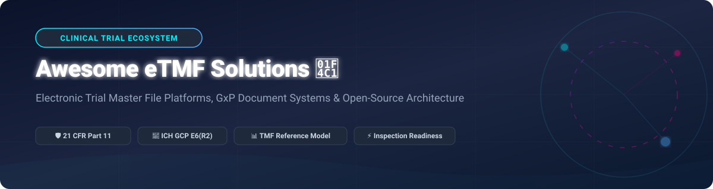

     

  

# 📑 Awesome Electronic Trial Master File (eTMF) Platforms & Tools 🚀

> **A curated directory of top commercial SaaS platforms and open-source software solutions for Electronic Trial Master File (eTMF) management, clinical document control, regulatory compliance, and GxP inspection readiness.**

---

## 💡 Overview & Sector Dynamics 📈

An **Electronic Trial Master File (eTMF)** is a specialized content management system used by pharmaceutical sponsors, Contract Research Organizations (CROs), and clinical trial sites to evaluate, manage, and store essential trial documents. eTMF systems ensure strict compliance with **ICH-GCP E6(R2)**, **FDA 21 CFR Part 11**, **EU Regulation 536/2014**, and alignment with the **TMF Reference Model** taxonomy.

> 🌐 **Market Size & Structure**: The global Electronic Trial Master File (eTMF) market is estimated at **$1.8 Billion – $2.5 Billion (2026)** and projected to exceed **$4.2 Billion by 2030** (CAGR ~14.5%). The sector is **highly concentrated (winner-takes-all dynamics)** dominated by tier-1 market leaders (Veeva Systems and Medidata) controlling over **65%+ total market share**, while mid-market CROs and niche GxP providers compete for specialized regional and study-level contracts.

---

## 📌 Table of Contents 🗺️

- [🏢 SaaS & Hosted Commercial Platforms](#-saas--hosted-commercial-platforms)
- [💻 Open-Source GitHub Projects](#-open-source-github-projects)
- [🛠️ Architecture & Implementation Guide](#️-architecture--implementation-guide)
- [🤝 How to Contribute](#-how-to-contribute)
- [⚖️ Disclaimer & Compliance Note](#️-disclaimer--compliance-note)
- [📈 Star History](#-star-history)
- [💖 Support & Sponsorship](#-support--sponsorship)

---

## 🏢 SaaS & Hosted Commercial Platforms 🌐

Below is a comparison table of leading enterprise SaaS eTMF platforms, sorted strictly by **Company Size / Revenue / Valuation in descending order**.

| Platform 🏢 | Company Size / Valuation / Revenue 💰 | Starting Pricing 💵 | Free Tier / Trial Limits 🎁 | Key Features & Compliance Focus 🛡️ |
| :--- | :--- | :--- | :--- | :--- |
| **[Veeva Vault eTMF](https://www.veeva.com/)** | **~$44.0 Billion Market Cap** (~$3.2B Annual Revenue) | **~$50,000/year** starting enterprise contract tier | **No free trial**; interactive live sandbox demo provided upon enterprise sales request | Dominant market leader; automated document filing, completeness metrics, TMF Reference Model v3.0, full 21 CFR Part 11. |
| **[Box Clinical](https://www.box.com/)** | **~$4.5 Billion Market Cap** (~$1.2B Annual Revenue) | **$35 per user/month** (Enterprise plan, annual billing) | **14-day free trial** (Enterprise plan, up to 100GB storage, 3 user minimum) | GxP-validated cloud content management; customizable TMF folder hierarchies, secure signature workflows, HIPAA & Part 11 compliance. |
| **[Medidata eTMF](https://www.medidata.com/)** | **$5.8 Billion Acquisition** (~$636M+ Annual Revenue) | **~$30,000/year** base per active protocol tier | **No free trial**; proof-of-concept environment provided upon enterprise qualification | Integrated into Medidata Clinical Cloud and Rave EDC; automated study milestone triggers, inspection dashboards. |
| **[MasterControl eTMF](https://www.mastercontrol.com/)** | **~$1.3 Billion Valuation** (~$200M ARR) | **~$25,000/year** base subscription tier | **No free trial**; guided sandbox walkthrough available upon request | Unified eTMF & Quality Management (QMS); real-time completeness tracking, document lifecycle control, automated audit trails. |
| **[TransPerfect Trial Interactive](https://www.transperfect.com/)** | **~$1.1 Billion Group Revenue** | **~$1,500/month** per active study site/protocol | **No free trial**; scheduled walkthrough & POC portal access upon request | Built-in linguistic validation and translation services, eISF integration, site onboarding, and global regulatory submission support. |
| **[Phlexglobal (PhlexTMF)](https://www.phlexglobal.com/)** | **~$150 Million Valuation** (~$60M Revenue) | **~$20,000/year** platform & service package tier | **No free trial**; custom demonstration & workflow audit available on request | Expert TMF consulting & managed services; strict TMF Reference Model alignment, AI-assisted document classification & indexing. |
| **[Florence eTMF](https://florencehc.com/)** | **~$100 Million+ Valuation** (~$58.6M Est. Revenue) | **~$1,200/study** (Academic/Site) or **~$15,000/year** (Sponsor) | **No free trial**; interactive software tour & sandbox environment upon request | Connects trial sites with sponsors/CROs; integrated eISF & eTMF, eSignatures, remote monitoring, high usability. |
| **[Ennov eTMF](https://www.ennov.com/)** | **~$30 Million Est. Revenue** | **~$18,000/year** starting suite tier (up to 5 studies) | **No free trial**; custom demo and regulatory compliance review session on request | Part of Ennov Regulatory & Quality Suite; multi-lingual document management, submission building, GxP workflow engines. |
| **[Montrium eTMF](https://www.montrium.com/)** | **~$15.6 Million Est. Revenue** | **~$12,000/year** starter tier (or ~$250/user/mo mid-market) | **No free trial**; self-guided demo video series & live sandbox demo on request | Built on Microsoft SharePoint; native Microsoft 365 workflow integration, cost-effective for growing biotech & mid-sized CROs. |
| **[DOCS eTMF](https://www.docs.com/)** | **~$10.0 Million Est. Revenue** | **~$10,000/year** starting protocol package | **No free trial**; live platform demonstration and validation docs preview on request | Purpose-built for small-to-mid sponsors and CROs; rapid deployment, predefined TMF Reference Model structure, audit readiness dashboards. |

---

## 💻 Open-Source GitHub Projects 🔓

> **Open-Source Reality Note**: No turn-key, zero-configuration open-source eTMF platform currently exists that complies out-of-the-box with 21 CFR Part 11. However, clinical software architects can leverage robust **Document Management Systems (DMS)**, **AI Quality Control platforms**, and **Exchange Frameworks** to construct custom compliant eTMF infrastructure.

Below are top open-source projects sorted by **GitHub Star Count in descending order**.

| Repository / Project 📦 | Star Count ⭐ | License 📜 | Category & Description 📝 |
| :--- | :--- | :--- | :--- |
| **[paperless-ngx/paperless-ngx](https://github.com/paperless-ngx/paperless-ngx)** |  | GPL-3.0 | **Enterprise Document Management System (DMS)**. Highly scalable OCR, automated document tagging, custom metadata fields, and REST API suitable for structuring TMF Reference Model document classes. |
| **[openkm/document-management-system](https://github.com/openkm/document-management-system)** |  | GPL-2.0 | **Most Viable eTMF Foundation**. Open-source DMS configurable with TMF Reference Model taxonomies, custom metadata attributes, electronic signing workflows, version control, and granular GxP access controls. |
| **[mayan-edms/mayan-edms](https://github.com/mayan-edms/mayan-edms)** |  | Apache-2.0 | **Electronic Document Management System**. Features automated document indexing, cryptographic signature validation, document workflow state engine, and comprehensive audit trail logging. |
| **[OpenClinica/OpenClinica](https://github.com/OpenClinica/OpenClinica)** |  | LGPL-2.1 | **Clinical Data Management Platform (EDC)**. Leading open-source electronic data capture and clinical data management engine with document store modules for trial site regulatory binders. |
| **[innolitics/rdm](https://github.com/innolitics/rdm)** |  | MIT | **Regulatory Documentation Manager**. Git-backed command-line tool for managing compliance documents, traceability matrices, and regulatory records under ISO 13485 / FDA regulations. |
| **[clinicedc/clinicedc](https://github.com/clinicedc/clinicedc)** |  | GPL-3.0 | **Longitudinal Clinical Trial Framework**. Django-based framework developed by Botswana-Harvard AIDS Institute Partnership. Includes `edc-document-archive` for clinical site file archiving. |
| **[TmfRef/exchange-framework](https://github.com/TmfRef/exchange-framework)** |  | Open Spec | **TMF Reference Model Exchange Mechanism Standard (EMS)**. Machine-readable XML/JSON specification for interoperable eTMF data exchange between sponsors, CROs, and regulatory bodies (CDISC aligned). |
| **[A78Daydreamer/QAtrial](https://github.com/A78Daydreamer/QAtrial)** |  | AGPL-3.0 | **AI-Powered Quality Management & eTMF Suite**. React 19 + Hono + PostgreSQL platform featuring dedicated eTMF document management modules, eConsent, GxP audit logs, and multi-country regulatory templates. |

---

## 🛠️ Architecture & Implementation Guide 📐

To build an open-source compliant eTMF stack for clinical research:

1. **Document Storage & Metadata Engine**: Deploy **OpenKM** or **Paperless-ngx** configured with custom metadata schemas corresponding to TMF Reference Model Zones (e.g., Zone 1: Trial Management, Zone 2: Central Supplies, Zone 3: IRB/IEC).
2. **Interoperability Standard**: Integrate the **TMF Reference Model Exchange Mechanism Standard (EMS)** schema to allow seamless XML/JSON import/export of document packages between CROs and sponsors.
3. **Quality & Audit Controls**: Utilize **QAtrial** or custom PostgreSQL audit tables to track document creation, versioning, quality control reviews, electronic signatures, and regulatory lock states.
4. **Validation & Security**: Implement strict RBAC (Role-Based Access Control), HTTPS, AES-256 encryption at rest, and maintain CSV (Computer System Validation) records for FDA 21 CFR Part 11 / Annex 11 compliance.

---

## 🤝 How to Contribute 🌟

Contributions are welcome! Help us keep this directory complete and up to date:

1. 🍴 **Fork** this repository.
2. 📝 Add or edit entries in `README.md` following the standard table formatting.
3. 🔍 Ensure descriptions are factual, links lead to official sites, and pricing/star data is accurate.
4. 📬 Submit a **Pull Request** with a brief summary of your changes.

---

## ⚖️ Disclaimer & Compliance Note ⚠️

- This list is **community-curated** for informational and educational purposes.
- Mention of commercial SaaS tools or open-source projects does not constitute endorsement or certification of compliance.
- eTMF systems handle mission-critical, regulated clinical trial documentation. Any software chosen must be validated in accordance with **FDA 21 CFR Part 11**, **EU Annex 11**, **ICH GCP E6(R2)**, and local regulatory mandates before use in human clinical trials.

---

## 📈 Star History

---

## 💖 Support & Sponsorship ☕

Thank you for visiting and using this resource! If you find this repository helpful for your clinical research, regulatory, or software engineering work, please consider supporting the project:

- ⭐ **Star** this repository on GitHub to increase its visibility.
- 🔀 **Fork** and share it with colleagues in clinical research & biopharma.
- ☕ **Sponsor / Buy me a coffee**: Support ongoing open-source maintenance via [GitHub Sponsors](https://github.com/sponsors/ishandutta2007).

---

  <i>Curated with ❤️ by <a href="https://github.com/ishandutta2007">Ishan Dutta</a> and the global open-source clinical research community. Discover more curated projects on <a href="https://github.com/ishandutta2007/Awesome-Awesome-Awesome">Awesome-Awesome-Awesome</a>.</i>

